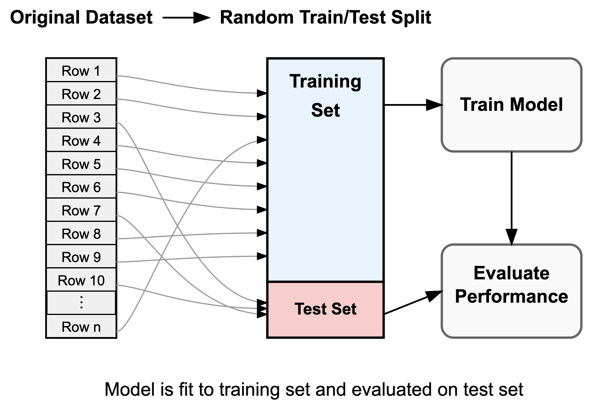
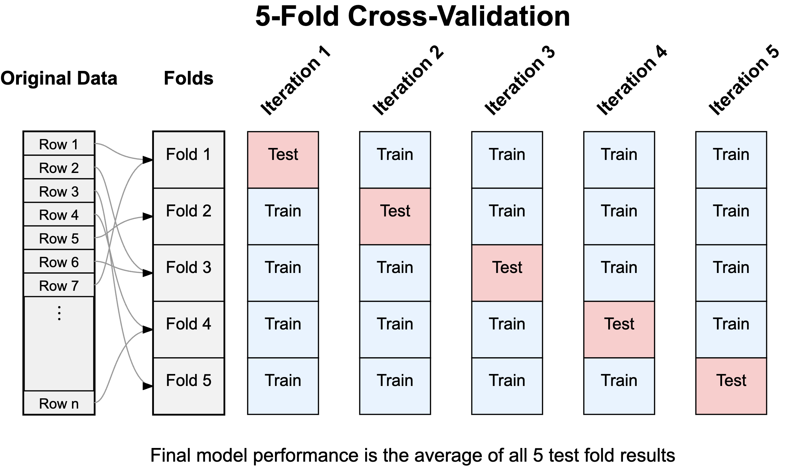

```{r}
#| label: setup
#| include: false

library(tidyverse)
library(lubridate)
library(scales)

knitr::opts_chunk$set(echo = FALSE, warning = FALSE, message = FALSE)
theme_set(theme_minimal(base_size = 13))

rmse <- function(actual, predicted) {
  sqrt(mean((actual - predicted)^2))
}

# ERCOT results reproduced by the verified analysis entry point.
ercot_performance <- read_csv(
  "data_derived/ercot/polynomial_performance.csv",
  show_col_types = FALSE
)

ercot_plot_data <- ercot_performance |>
  select(degree, train_rmse, test_rmse) |>
  pivot_longer(
    c(train_rmse, test_rmse),
    names_to = "sample",
    values_to = "rmse"
  ) |>
  mutate(
    sample = factor(
      sample,
      levels = c("train_rmse", "test_rmse"),
      labels = c("2018 training data", "2019 new data")
    )
  )

best_ercot_degree <- ercot_performance |>
  slice_min(test_rmse, n = 1, with_ties = FALSE) |>
  pull(degree)

ercot_clip_ceiling <- 1250

ercot_display_data <- ercot_plot_data |>
  mutate(
    clipped = rmse > ercot_clip_ceiling,
    display_rmse = pmin(rmse, ercot_clip_ceiling),
    point_degree = degree + case_when(
      clipped & sample == "2018 training data" ~ -0.055,
      clipped & sample == "2019 new data" ~ 0.055,
      TRUE ~ 0
    )
  )

p_ercot_rmse <- ggplot(
  ercot_display_data,
  aes(degree, display_rmse, color = sample, group = sample)
) +
  geom_line(linewidth = 1) +
  geom_point(
    data = filter(ercot_display_data, !clipped),
    size = 2
  ) +
  geom_point(
    data = filter(ercot_display_data, clipped),
    aes(x = point_degree),
    shape = 17,
    size = 3.2
  ) +
  geom_vline(
    xintercept = best_ercot_degree,
    color = "grey45",
    linetype = "dashed",
    linewidth = 0.6
  ) +
  annotate(
    "text",
    x = 1.35,
    y = 1215,
    label = "Degree 1: 2,578 MW (2018 training), 2,343 MW (2019)",
    hjust = 0,
    size = 3.4,
    color = "grey30"
  ) +
  scale_x_continuous(breaks = seq(1, 20, by = 1)) +
  scale_y_continuous(
    breaks = c(600, 800, 1000, 1200),
    labels = comma,
    limits = c(580, ercot_clip_ceiling),
    expand = expansion(mult = c(0.02, 0.02))
  ) +
  scale_color_manual(
    NULL,
    values = c(
      "2018 training data" = "#0173B2",
      "2019 new data" = "#DE8F05"
    )
  ) +
  labs(
    x = "Polynomial degree",
    y = "RMSE (MW)"
  ) +
  theme(
    legend.position = "top",
    panel.grid.minor.x = element_blank()
  )

# Conceptual bias-variance curves. Their shapes illustrate the tradeoff rather
# than representing estimates from a particular dataset.
bias_variance_curves <- tibble(
  flexibility = seq(0, 1, length.out = 400),
  squared_bias = 1.05 * exp(-3.2 * flexibility) + 0.03,
  variance = 0.06 + 0.075 * exp(2.8 * flexibility),
  irreducible_error = 0.18
) |>
  mutate(
    expected_prediction_error =
      squared_bias + variance + irreducible_error
  )

curve_value <- function(variable, flexibility_value) {
  approx(
    bias_variance_curves$flexibility,
    bias_variance_curves[[variable]],
    xout = flexibility_value
  )$y
}

p_bias_variance <- ggplot(bias_variance_curves, aes(flexibility)) +
  geom_line(
    aes(y = expected_prediction_error),
    color = "grey15",
    linewidth = 1.25
  ) +
  geom_line(
    aes(y = squared_bias),
    color = "#0173B2",
    linewidth = 1,
    linetype = "dashed"
  ) +
  geom_line(
    aes(y = variance),
    color = "#DE8F05",
    linewidth = 1,
    linetype = "dotdash"
  ) +
  annotate(
    "text",
    x = 0.18,
    y = curve_value("squared_bias", 0.18) + 0.08,
    label = "Squared bias",
    color = "#0173B2",
    hjust = 0,
    size = 3.8
  ) +
  annotate(
    "text",
    x = 0.77,
    y = curve_value("variance", 0.77) + 0.08,
    label = "Variance",
    color = "#DE8F05",
    hjust = 0,
    size = 3.8
  ) +
  annotate(
    "text",
    x = 0.38,
    y = curve_value("expected_prediction_error", 0.38) + 0.20,
    label = "Expected squared prediction error",
    color = "grey15",
    hjust = 0,
    size = 3.8
  ) +
  scale_x_continuous(
    breaks = c(0, 1),
    labels = c("Less flexible", "More flexible"),
    expand = expansion(mult = c(0.02, 0.08))
  ) +
  scale_y_continuous(
    breaks = NULL,
    expand = expansion(mult = c(0.02, 0.08))
  ) +
  labs(x = "Model flexibility", y = "Error") +
  theme(
    panel.grid = element_blank(),
    axis.ticks = element_blank()
  )

# Austin models used for the random-split and cross-validation comparison.
houses <- read_csv(
  "data/austin_houses/austin_houses_subset.csv",
  show_col_types = FALSE
) |>
  mutate(
    price = latest_price,
    area = living_area_sq_ft / 1000,
    lot = lot_size_sq_ft / 10000,
    beds = num_of_bedrooms,
    baths = num_of_bathrooms,
    stories = num_of_stories,
    school = avg_school_rating,
    school_dist = avg_school_distance,
    lat = (latitude - 30.31) * 100,
    lon = (longitude + 97.71) * 100,
    photos = num_of_photos / 10,
    zip = factor(zipcode)
  )

simple_formula <- price ~ area

natural_formula <- price ~
  area * zip + beds + baths + stories + age + lot + school + school_dist +
  lat + lon + garage_spaces + has_garage + has_spa + has_view +
  has_association + latest_saleyear

wild_formula <- price ~
  zip * (
    poly(area, 4, raw = TRUE) +
      poly(age, 4, raw = TRUE) +
      poly(lot, 4, raw = TRUE)
  ) +
  poly(lat, 3, raw = TRUE) * poly(lon, 3, raw = TRUE) +
  poly(school, 3, raw = TRUE) +
  poly(school_dist, 3, raw = TRUE) +
  poly(photos, 3, raw = TRUE) +
  beds + baths + stories + garage_spaces + has_garage + has_spa +
  has_view + has_association + latest_saleyear

model_formulas <- list(
  simple = simple_formula,
  natural = natural_formula,
  wild = wild_formula
)

model_labels <- c(
  simple = "Area only",
  natural = "Area + Others (Linear)",
  wild = "Expanded nonlinear"
)

model_descriptions <- tibble(
  model = factor(unname(model_labels), levels = unname(model_labels)),
  description = c(
    "Living area",
    "Living area, ZIP code, and ordinary listing fields",
    "Nonlinear transformations and interactions among listing fields"
  ),
  terms = map_int(
    model_formulas,
    ~ ncol(model.matrix(.x, data = houses)) - 1
  )
)

# The first 100 integer seeds define the repeated-split display. No seed was
# selected for producing a favorable or unfavorable model ranking.
model_matrices <- map(model_formulas, ~ model.matrix(.x, data = houses))
outcome <- houses$price
n_houses <- nrow(houses)
n_test <- round(0.20 * n_houses)

split_rmse <- function(seed) {
  set.seed(seed)
  test_id <- sample.int(n_houses, n_test)
  train_id <- setdiff(seq_len(n_houses), test_id)

  imap_dfr(model_matrices, function(x, model_name) {
    fit <- lm.fit(x[train_id, , drop = FALSE], outcome[train_id])
    beta <- fit$coefficients
    beta[is.na(beta)] <- 0
    train_prediction <- drop(x[train_id, , drop = FALSE] %*% beta)
    test_prediction <- drop(x[test_id, , drop = FALSE] %*% beta)

    tibble(
      split = seed,
      model = factor(model_labels[[model_name]], levels = unname(model_labels)),
      `Training data` = rmse(outcome[train_id], train_prediction),
      `Test data` = rmse(outcome[test_id], test_prediction)
    )
  }) |>
    pivot_longer(
      c(`Training data`, `Test data`),
      names_to = "sample",
      values_to = "rmse"
    ) |>
    mutate(sample = factor(sample, levels = c("Training data", "Test data")))
}

split_results <- map_dfr(1:100, split_rmse)

split_medians <- split_results |>
  summarize(rmse = median(rmse), .by = c(model, sample))

clipped_new_data <- split_results |>
  filter(sample == "Test data", rmse > 220000) |>
  nrow()

# How often the expanded model beats the middle model on held-out houses.
n_reversals <- split_results |>
  filter(sample == "Test data") |>
  select(split, model, rmse) |>
  pivot_wider(names_from = model, values_from = rmse) |>
  summarize(n = sum(`Expanded nonlinear` < `Area + Others (Linear)`)) |>
  pull(n)

clip_annotation <- tibble(
  model = factor("Expanded nonlinear", levels = unname(model_labels)),
  rmse = 220000,
  label = paste(clipped_new_data, "new-data RMSEs above $220K")
)

p_austin_splits <- ggplot() +
  geom_line(
    data = split_results,
    aes(model, rmse, color = sample, group = interaction(split, sample)),
    alpha = 0.04,
    linewidth = 0.4
  ) +
  geom_point(
    data = split_results,
    aes(model, rmse, color = sample),
    alpha = 0.07,
    size = 0.7
  ) +
  geom_line(
    data = split_medians,
    aes(model, rmse, color = sample, group = sample),
    linewidth = 1.2
  ) +
  geom_point(
    data = split_medians,
    aes(model, rmse, color = sample, shape = sample),
    size = 2.8
  ) +
  geom_text(
    data = clip_annotation,
    aes(model, rmse, label = label),
    inherit.aes = FALSE,
    hjust = 1,
    vjust = 1.3,
    size = 3,
    color = "grey30"
  ) +
  coord_cartesian(ylim = c(115000, 220000)) +
  scale_y_continuous(
    labels = label_dollar(scale = 1 / 1000, suffix = "K"),
    breaks = seq(120000, 220000, by = 20000)
  ) +
  scale_color_manual(
    NULL,
    values = c("Training data" = "#0173B2", "Test data" = "#DE8F05")
  ) +
  scale_shape_manual(
    NULL,
    values = c("Training data" = 16, "Test data" = 17)
  ) +
  labs(
    x = NULL,
    y = "RMSE"
  ) +
  theme(
    legend.position = "top",
    panel.grid.major.x = element_blank(),
    panel.grid.minor = element_blank()
  )

make_balanced_folds <- function(n, k, seed) {
  set.seed(seed)
  sample(rep(seq_len(k), length.out = n))
}

cv_folds <- make_balanced_folds(n_houses, 5, 20260722)

kfold_results <- map_dfr(sort(unique(cv_folds)), function(fold) {
  test_id <- which(cv_folds == fold)
  train_id <- which(cv_folds != fold)

  imap_dfr(model_matrices, function(x, model_name) {
    fit <- lm.fit(x[train_id, , drop = FALSE], outcome[train_id])
    beta <- fit$coefficients
    beta[is.na(beta)] <- 0

    train_prediction <- drop(x[train_id, , drop = FALSE] %*% beta)
    test_prediction <- drop(x[test_id, , drop = FALSE] %*% beta)

    bind_rows(
      tibble(
        sample = "Training data",
        squared_error = (outcome[train_id] - train_prediction)^2
      ),
      tibble(
        sample = "Test data",
        squared_error = (outcome[test_id] - test_prediction)^2
      )
    ) |>
      summarize(
        rmse = sqrt(mean(squared_error)),
        squared_error = sum(squared_error),
        n_observations = n(),
        .by = sample
      ) |>
      mutate(
        fold = fold,
        model = factor(
          model_labels[[model_name]],
          levels = unname(model_labels)
        ),
        sample = factor(sample, levels = c("Training data", "Test data"))
      )
  })
})

cv_pooled <- kfold_results |>
  summarize(
    rmse = sqrt(sum(squared_error) / sum(n_observations)),
    .by = c(model, sample)
  )

p_austin_fivefold <- ggplot() +
  geom_line(
    data = kfold_results,
    aes(model, rmse, color = sample, group = interaction(fold, sample)),
    alpha = 0.42,
    linewidth = 0.65
  ) +
  geom_point(
    data = kfold_results,
    aes(model, rmse, color = sample, shape = sample),
    alpha = 0.58,
    size = 1.8
  ) +
  geom_line(
    data = cv_pooled,
    aes(model, rmse, color = sample, group = sample),
    linewidth = 1.3
  ) +
  geom_point(
    data = cv_pooled,
    aes(model, rmse, color = sample, shape = sample),
    size = 3
  ) +
  scale_y_continuous(
    labels = label_dollar(scale = 1 / 1000, suffix = "K"),
    breaks = pretty_breaks(6)
  ) +
  scale_color_manual(
    NULL,
    values = c("Training data" = "#0173B2", "Test data" = "#DE8F05")
  ) +
  scale_shape_manual(
    NULL,
    values = c("Training data" = 16, "Test data" = 17)
  ) +
  labs(x = NULL, y = "RMSE") +
  theme(
    legend.position = "top",
    panel.grid.major.x = element_blank(),
    panel.grid.minor = element_blank()
  )

cv_summary <- cv_pooled |>
  filter(sample == "Test data") |>
  select(model, rmse) |>
  arrange(rmse)

model_term_count <- function(label) {
  model_descriptions |>
    filter(model == label) |>
    pull(terms)
}

cv_rmse_value <- function(label) {
  cv_summary |>
    filter(model == label) |>
    pull(rmse)
}

ercot_test_rmse_value <- function(degree_value) {
  ercot_performance |>
    filter(degree == degree_value) |>
    pull(test_rmse)
}
```

## In-sample prediction error {#sec-new-data-in-sample}

In @sec-rse we used residual standard error to summarize the prediction errors from a fitted regression. Those residuals came from the same observations we used to estimate the model. They tell us how closely the model fits the data in hand.

Prediction usually asks about observations we have not seen yet. A homebuyer cares how accurately a model will value the next house, not how closely it reproduces prices that helped determine its coefficients. An electricity provider cares about tomorrow's load. These questions concern **new-data prediction error**: the errors a fitted model makes on observations that played no role in fitting it.

The distinction matters whenever we compare models of different complexity. Adding terms gives a regression more ways to match the observations used to fit it, so its sum of squared residuals cannot increase. Some of that improvement may represent stable predictive information. Some may come from fitting features peculiar to one sample.

## ERCOT in a new year {#sec-ercot-new-year}

The ERCOT load data give us a clean first look at this problem. Daily electricity demand in North Central Texas is high on cold and hot days and lower on mild days. A line misses this U-shaped relationship, while polynomial terms let the fitted curve bend.

We fit polynomial models of degrees 1 through 20 using the 365 daily observations from 2018. These are the training observations, the data that estimate each model. We then use each fitted model to predict load for the 365 days in 2019. The two years cover comparable temperatures: every 2019 daily mean temperature falls within the range observed in 2018. High-degree models therefore cannot blame their errors on extrapolation beyond the training temperatures.

@fig-ercot-new-data-error compares the root mean squared error, or RMSE, on the two years: square each prediction error, average the squares, and take the square root. The result is in megawatts, like the loads themselves. The blue series measures the errors on the 2018 observations used to fit each model. The orange series measures errors on new observations from 2019.

```{r}
#| label: fig-ercot-new-data-error
#| fig-cap: "Prediction error for polynomial models fit to 2018 ERCOT observations. The degree-1 RMSE values are clipped at 1,250 MW and labeled with their actual values. Training RMSE falls with degree, while 2019 RMSE eventually rises."
#| fig-width: 9
#| fig-height: 5.4

p_ercot_rmse
```

The two error curves answer different questions. Training RMSE cannot rise with degree, because each higher-degree model retains all the lower-degree terms. Here it falls at every step, and degree 20 fits the 2018 data best among these candidates. The 2019 curve instead reaches a broad low region among the intermediate degrees and rises for the most flexible models. You may notice that the 2019 errors sit below the 2018 errors at most degrees. That reflects the years, not the models: 2019 load was easier to predict than 2018 load for every candidate here. The levels of the two curves are therefore not directly comparable. Overfitting shows up in their shapes: training error keeps falling while 2019 error eventually rises.

Degrees 5 and 6 are essentially tied for the lowest 2019 RMSE in this particular comparison, at about `r comma(ercot_test_rmse_value(6), accuracy = 10)` MW; degree 6 wins by a fraction of a megawatt. That result does not establish degree 6 as the correct model for electricity demand in general. We inspected 2019 to compare the candidates, so 2019 has now helped us choose the model. A later year would be needed to evaluate the selected degree on data that remained untouched throughout model selection.

## The bias-variance tradeoff {#sec-bias-variance}

The ERCOT curves illustrate the **bias-variance tradeoff**. A model can predict poorly because it imposes too much structure or because it responds too strongly to the particular sample used to fit it. More flexibility reduces the first problem while increasing the second.

The degree-1 model **underfits**. Its straight line cannot represent the persistent U-shaped relationship between load and temperature, so its predictions have high bias. More observations would estimate that line more precisely, but they would not give it the bend it lacks.

The highest-degree models face the opposite problem. They can respond to smaller features in the 2018 observations, including features that reflect idiosyncratic variation rather than a stable relationship. A model that learns this sample-specific variation **overfits**. If we collected another sample and fit the model again, its smaller bends could move substantially; that sensitivity is variance.

Intermediate degrees balance these two sources of error better in this example. They are flexible enough to capture the broad U-shape but structured enough to resist smaller sample features. You can see the result in the orange curve: new-data error falls as we repair the line's underfit, then rises when added flexibility becomes more costly than useful.

The conceptual curves in @fig-bias-variance generalize this pattern. For prediction judged by squared error, expected prediction error splits exactly into three pieces: the square of the bias, the variance, and irreducible error. We state this decomposition without proof; the bias appears squared because the errors are squared before averaging. As model flexibility increases, squared bias decreases while variance increases. Irreducible error remains even for the best model because no available predictors perfectly determine the outcome. The sum of the three pieces produces a U-shaped curve for expected squared prediction error.

```{r}
#| label: fig-bias-variance
#| fig-cap: "The bias-variance tradeoff. Greater model flexibility reduces squared bias but increases variance. Their sum with irreducible error produces a U-shaped expected squared prediction-error curve."
#| fig-width: 8.5
#| fig-height: 4.7

p_bias_variance
```

Polynomial degree gives us one concrete measure of flexibility. A degree-$k$ polynomial has $k$ terms built from its predictor and can represent more bends as $k$ increases. For a broader regression, the number of terms gives a similar rough measure: more terms give the fitted model more ways to respond to the training sample.

The 2019 observations revealed this only after the year arrived. Model selection needs an earlier answer. We need to mimic the arrival of new observations using the data we already have.

## Training and testing data {#sec-training-testing}

We can create a stand-in for future data by dividing the observations we have. The **training data** are the observations used to estimate the model. The **testing data** are observations set aside to measure how the fitted model predicts new cases.

The procedure has a strict order, as @fig-random-train-test-split shows. We fit each candidate using only the training observations. We then predict outcomes in the testing data and compare them with the outcomes we held back. If you let information from a test observation enter the fitting process, it no longer supplies a new-data prediction.

{#fig-random-train-test-split width=100% fig-pos="H"}

For a quantitative outcome, we can summarize the held-out errors with test RMSE:

$$
\operatorname{RMSE}_{\mathrm{test}}
=
\sqrt{\frac{1}{n_{\mathrm{test}}}
\sum_{i\in\mathrm{test}}(y_i-\widehat y_i)^2}.
$$

The test RMSE is the square root of the average squared prediction error among observations that were not used to fit the model. It uses the outcome's original units, so a test RMSE of $150,000 means that the typical scale of the held-out errors is about $150,000.

Test RMSE is essentially the same recipe as the residual standard error from the earlier regression chapter, applied to different observations. The RSE averages squared residuals from the same data used to estimate the coefficients. Test RMSE averages squared errors for observations that played no part in the fit.

Held-out data help only when they resemble the cases where the model will be used. A random split can mimic future draws from the same population. It cannot describe performance after the population changes, such as when the housing market shifts or predictions move to a new region.

### Random training and testing splits {#sec-random-splits}

The familiar Austin housing data let us see what a random split contributes. The subset contains `r comma(n_houses)` houses from three ZIP codes. No single time cutoff defines the prediction task here, so we randomly place 80% of the houses in training data and reserve 20% for testing.

Random assignment tends to preserve the observed mixture of large and small homes, ZIP codes, and other attributes on both sides of the split. That makes it a reasonable starting point for predicting another house from the same historical population. It does not protect us against a future market that differs systematically from these observations.

We compare the three price models in @tbl-austin-models. The number of terms excludes the intercept and provides a rough ordering of their flexibility. The formulas stay behind the scenes because the comparison depends on what each model can represent, not on software syntax.

```{r}
#| label: tbl-austin-models
#| tbl-cap: "The three Austin price models, ordered from least to most flexible."

model_descriptions |>
  rename(
    Model = model,
    Description = description,
    Terms = terms
  ) |>
  knitr::kable(align = c("l", "l", "r"))
```

The area-only model deliberately leaves useful information out. **Area + Others (Linear)** adds the ZIP code, ordinary listing attributes, and an interaction that lets the area relationship differ across ZIP codes. The **expanded nonlinear** model adds polynomial transformations and interactions among the listing fields, raising the count from `r model_term_count("Area + Others (Linear)")` to `r model_term_count("Expanded nonlinear")` terms.

The expanded nonlinear model is deliberately more flexible than the available sample seems to support. Its role is to make the cost of excess flexibility visible. Nonlinear terms and interactions are not inherently harmful; earlier chapters used both to represent relationships that a simpler model missed.

One random split gives one estimate of new-data error, and a different split can give a different answer. @fig-austin-split-distribution repeats the 80/20 procedure for `r n_distinct(split_results$split)` random splits. For each split, all three models use exactly the same training and testing houses, which makes their comparison fair.

```{r}
#| label: fig-austin-split-distribution
#| fig-cap: !expr 'paste0("Training and test RMSE across 100 80/20 splits of the Austin housing data. Each faint line connects results from one split, and thick lines mark medians; ", clipped_new_data, " test RMSEs above $220,000 are clipped.")'
#| fig-width: 9
#| fig-height: 4.8
#| fig-pos: H

p_austin_splits
```

Each faint path records how error changes across the three models within one split. Training RMSE falls every time. Test RMSE varies much more: in `r n_reversals` of the `r n_distinct(split_results$split)` splits, the expanded nonlinear model actually beats Area + Others (Linear) on the held-out houses.

The thick lines show medians across the `r n_distinct(split_results$split)` splits. Median test RMSE falls when we move beyond area alone, then rises when we add the expanded nonlinear terms. The median therefore follows the bias-variance U-shape even though the individual paths are noisy. The annotation counts the `r clipped_new_data` expanded-model test RMSEs above the $220,000 plotting limit rather than stretching the axis until the main pattern disappears.

A single train/test split hides this variability. Repeating the split shows the range of plausible comparisons, but an unorganized collection of splits creates another problem. Some houses may appear in testing data many times, while others may never receive a held-out prediction.

## Cross-validation {#sec-cross-validation}

**Cross-validation** organizes repeated splits so that every observation takes a turn in the testing data. In five-fold cross-validation, we randomly divide the rows into five approximately equal groups called folds. We then run five linked train/test comparisons.

::: {.callout-note}
## Five-fold cross-validation

1. Randomly divide the observations into five groups of approximately equal size.
2. Hold out the first group, fit the candidate model to the other four groups, and predict the held-out observations.
3. Repeat the fit-and-predict step until each group has served as the testing data once.
4. Pool the squared errors from all held-out predictions.
5. Take the square root of their average to obtain the cross-validated RMSE.
:::

The five fits give every house exactly one prediction from a model that did not train on that house. Pooling the 1,103 squared held-out errors and taking their root mean produces one cross-validated RMSE for each candidate. The folds do not create five independent datasets; together, they create one complete set of out-of-sample predictions.

@fig-fivefold-partition shows the five linked fits. Each fold supplies testing observations once and training observations four times.

{#fig-fivefold-partition width=100% fig-pos="H"}

Candidate models should use the same fold assignments. Otherwise, differences in RMSE would combine differences between the models with accidental differences between their testing observations. Here each fold holds out about 20% of the Austin houses, matching the testing fraction in the earlier random splits.

@fig-austin-fivefold shows the training and test errors from the five fits. Faint paths retain the fold-to-fold variation, while the thick paths pool squared errors over all five folds.

```{r}
#| label: fig-austin-fivefold
#| fig-cap: "Training and test RMSE for the five cross-validation folds. Each faint line represents one fold; thick lines pool squared errors across all five folds."
#| fig-width: 9
#| fig-height: 5.1
#| fig-pos: H

p_austin_fivefold
```

```{r}
#| label: tbl-austin-fivefold
#| tbl-cap: "Five-fold cross-validated RMSE for the three Austin price models. Every house contributes one held-out prediction."

cv_summary |>
  transmute(
    Model = model,
    RMSE = dollar(rmse, accuracy = 1)
  ) |>
  knitr::kable(align = c("l", "r"))
```

The pooled results select Area + Others (Linear), with a five-fold RMSE of about `r dollar(cv_rmse_value("Area + Others (Linear)"), accuracy = 1)`. The expanded nonlinear model follows at `r dollar(cv_rmse_value("Expanded nonlinear"), accuracy = 1)`, and the area-only model trails at `r dollar(cv_rmse_value("Area only"), accuracy = 1)`. The gap between the middle two models is only about `r dollar(cv_rmse_value("Expanded nonlinear") - cv_rmse_value("Area + Others (Linear)"), accuracy = 100)`, but it runs opposite to their training errors: the `r model_term_count("Expanded nonlinear")`-term model fits its training rows more closely and predicts the held-out rows less accurately.

This comparison also clarifies what cross-validation can and cannot do. It gives each model the same repeated opportunities to predict observations left out of fitting, which reduces dependence on one arbitrary split. It still evaluates predictions for houses like those in this historical sample. A forecasting problem would usually preserve time order, and a problem involving new locations might hold out whole geographic groups instead of random rows.

## Beyond term counting {#sec-new-data-endpoint}

For these Austin data, Area + Others (Linear) predicts held-out houses better than either the area-only or expanded nonlinear specification. The simpler model underfits, while the expanded model spends some of its additional flexibility on patterns that do not persist outside its training rows. In-sample fit alone points in the wrong direction.

Cross-validation gives us a defensible way to compare a short list of candidate models. The remaining problem is how to control complexity when a model begins with hundreds or thousands of possible terms. Counting terms becomes awkward at that scale, and discarding predictors one at a time is unstable.
